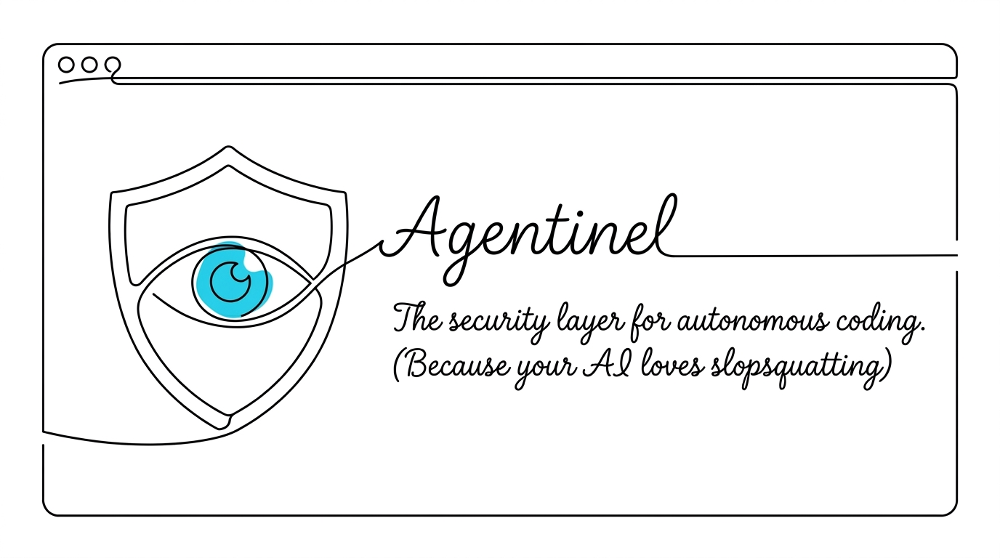

<div align="center">
  

  [](https://www.npmjs.com/package/agentinel)
  [](LICENSE)
  [](https://github.com/aman-janwani/agentinel/actions)
  [](#)
</div>

<br />

> **The zero-cost, locally-run package guardrail for your AI coding agents.**

*Agentinel guards your AI agent when it installs npm packages, catching hallucinated dependencies, slopsquatting, and malicious packages before they execute on your machine.*

---

## 📖 The Problem

AI coding agents (like Claude Code, Copilot, or Cursor) install dependencies on your behalf, often while you aren't looking closely. 
- Sometimes they install a package that was registered last week with no history. 
- Sometimes they install a package whose name they entirely **hallucinated**. 
- Sometimes, they install a legitimate package that pulls in a compromised one three levels deep.

**Agentinel** checks every package an install would bring in, at the exact moment the agent reaches for it. It evaluates the package against a bundled, locally-run database of over 216,000 known malicious packages and zero-cost registry heuristics. It then tells the agent why something looks wrong so the AI can back off and reconsider.

Every other tool in this space guards your terminal. **Agentinel guards your agent.**

---

## ⚡ Features & Security Philosophy

- **Zero-Cost & Private:** Agentinel does no network interception, runs no cloud proxies, and requires no paid APIs. The malware list is matched locally.
- **Deep Tree Scanning:** Checks every package an install would *actually* bring in, not just the one named. (`npm install express` brings in 67 packages. We check all 67).
- **Known Malware:** Bundles a local OSV database of 216,000+ confirmed malicious packages.
- **Zero False Positives on Popular Packages:** Tested against the top 100 npm packages.
- **Heuristic Scanning:** Flags npm takedowns, packages under 30 days old with < 1k downloads (slopsquatting), publisher drift, and non-existent hallucinated names.
- **Cross-Platform Compatibility:** Fully tested and natively supported across macOS, Linux, and Windows.
- **Fails Open:** Designed so that if it crashes or can't reach the registry, it fails open. It will never permanently wedge your terminal or block your work.

---

## 🚀 Installation

For the best experience across all your projects and to use the short `asen` alias, install Agentinel globally:

```sh
npm install -g agentinel
asen init
```

Alternatively, you can install it as a dev-dependency per-project:
```sh
npm install --save-dev agentinel
npx agentinel init
```
*(No account, no server, no complex configuration.)*

---

## 🤖 1. Agentic Use (Native Hooks)

Agentinel wires itself directly into the native pre-execution hooks of popular CLI agents: **Claude Code, Codex CLI, Copilot CLI, and Gemini CLI**. 

When an agent attempts to run `npm install`, Agentinel intercepts the event (e.g., `PreToolUse` for Claude) and scans the requested dependency tree. 

### How it feeds back to the AI
If Agentinel flags a package, it feeds the context *back* to the AI agent in a concise format the agent understands, rather than just crashing the terminal.

**Example Intercept:**
```json
{
  "hookEvent": "PreToolUse",
  "action": "BLOCK",
  "reason": "agentinel blocked 'react-router-v7-beta': Package does not exist on npm (hallucination)."
}
```
The AI reads this, realizes the package is fake or malicious, and intelligently searches for the correct alternative instead of blindly retrying.

---

## 🧑‍💻 2. Normal / Human Use (The Shim)

What about installs that never go through an agent? (e.g., You typing `npm install` manually). 

Agentinel provides an opt-in **PATH shim**. By default, running `npx asen init` installs this shim automatically.

```sh
npx asen init
```

This puts a tiny, fail-open wrapper script earlier in your `PATH`. When you type `npm install`, the shim checks the package first. If it's safe, the real `npm` command runs instantly. 

**Terminal Example:**
```bash
$ npm install left-pad-malicious

⚠️ agentinel warning: left-pad-malicious is 2 days old and has 12 downloads.
This matches the profile of a slopsquatting or malicious package.
```

---

## 🔒 3. The Git Pre-Commit Hook

As a final safety net, `asen init` installs a Git pre-commit hook. 
Before you can commit a change to `package-lock.json`, Agentinel scans the staged lockfile. If a poisoned dependency slipped in somehow, the commit is flagged, ensuring malware never reaches your `main` branch.

---

## ⚖️ Competitors vs. Us

How do we stack up against traditional commercial security scanners?

| Feature | Agentinel (Us) | Commercial Alternatives |
|---|---|---|
| **Cost Model** | **100% Free / Zero-cost** | Monthly Subscriptions |
| **Data Privacy** | **100% Local (No cloud)** | Sends telemetry/code to cloud |
| **Agent Hooking** | **Native (intercepts AI directly)** | Scans terminal post-facto |
| **Feedback Loop** | **Tells AI *why* it failed** | Just blocks the terminal |
| **Setup** | **Zero-config, drop-in** | Requires API keys & accounts |
| **Malware Database** | Local OSV Feed (~216k pkgs) | Proprietary Feeds |
| **Feed Freshness** | *Lags 1-3 days behind OSV* | Real-time / Minutes |
| **Detection Method** | *Version-exact + Heuristics* | Advanced Behavioral Analysis |

*Note: We currently lag slightly on feed freshness (by a few days) and advanced behavioral analysis compared to paid enterprise tools. These are areas we acknowledge and plan to explore and improve in future versions, without compromising our zero-cost, 100% local philosophy.*

---

## ⚙️ Modes: warn vs strict

Agentinel supports two operating modes, controlled by the `mode` field. You can switch between them using `npx asen mode <warn|strict>`.

### warn (default)
Agentinel surfaces a warning in the agent output but does not block the install. The agent decides whether to proceed.

`.agentinel.json`
```json
{
  "mode": "warn"
}
```
*Best for teams migrating to Agentinel gradually or using agents in read-heavy workflows.*

### strict
Agentinel hard-blocks the install and returns an error payload to the agent. The install never reaches npm.

`.agentinel.json`
```json
{
  "mode": "strict"
}
```
*Recommended for production repos, CI pipelines, and any project with autonomous agentic access.*

---

## 🧰 Command Reference

You can run Agentinel using `npx agentinel <command>`. 
If you have installed `agentinel` globally (`npm install -g agentinel`) or locally in your project, you can use the shorter alias: `npx asen <command>` (or just `asen <command>` if global).

Here are all the commands:

### `npx asen init [--no-shim]`
Wires up agent hooks and git hooks in the current repo, and installs the global PATH shim for human terminal protection.
```bash
$ npx asen init
wrote .agentinel.json
registered the Claude Code PreToolUse hook in .claude/settings.json
installed the git pre-commit hook in .git/hooks
wrote shims for npm, npx, pnpm, yarn, bun in /Users/user/.agentinel/bin
added the shims to PATH in /Users/user/.zshrc
Mode is strict, so a risky package typed at the terminal will be blocked.
Open a new terminal, or run `asen unshim` to undo this.

agentinel is set up. New npm packages will be checked before they land.
Default mode is strict. Set "mode": "warn" in .agentinel.json to only warn instead.
```

When used with `--no-shim`, it wires up hooks but skips installing the global PATH shim.
```bash
$ npx asen init --no-shim
wrote .agentinel.json
registered the Claude Code PreToolUse hook in .claude/settings.json
installed the git pre-commit hook in .git/hooks

agentinel is set up. New npm packages will be checked before they land.
Default mode is strict. Set "mode": "warn" in .agentinel.json to only warn instead.
```

### `npx asen check [pkg...]`
Scans the unstaged (or newly added) dependencies in your working tree, including the lockfile. Exits non-zero if flagged. (The Git pre-commit hook uses a strictly staged version of this check).
```bash
$ npx asen check
checked 142 package(s), nothing suspicious
```

Scans a specific package instantly without installing it.
```bash
$ npx asen check react-router-v7-fake
⚠️ agentinel warning: react-router-v7-fake is 1 day old and has 4 downloads.
This matches the profile of a slopsquatting or malicious package.
```

### `npx asen allow <pkg> --reason "..."`
Adds a package to the allowlist in `.agentinel.json` with a required reason. This provides an audited trail for your team.
```bash
$ npx asen allow my-internal-pkg --reason "Internal company package not on public npm"
allowlisted my-internal-pkg in .agentinel.json
```

### `npx asen mode <warn|strict>`
Switches Agentinel's operating mode in the `.agentinel.json` file.
```bash
$ npx asen mode strict
set mode to strict in .agentinel.json
```

### `npx asen uninstall`
Completely removes all Agentinel hooks from your repository config files (`.claude`, `.gemini`, `.github`, etc.) and removes global shims.
```bash
$ npx asen uninstall
agentinel has been completely uninstalled from this repository.
```

### `npx asen unshim`
Removes the global PATH shim.
```bash
$ npx asen unshim
removed /Users/user/.agentinel/bin
removed the PATH line from /Users/user/.zshrc
```

---

## 🤝 Contributing & Maintainers

We welcome contributions! 
- Please read our [CONTRIBUTING.md](CONTRIBUTING.md) for details on our code of conduct, the zero-cost architecture rules, and the process for submitting pull requests.

**Maintainer:** [Aman Janwani](https://github.com/aman-janwani)

## 📄 License

This project is licensed under the MIT License - see the [LICENSE](LICENSE) file for details.
